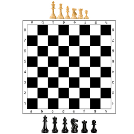

# Вступ до мови C: Повний посібник для першокурсника

Ласкаво просимо до світу програмування на C! Ця мова — як механічна коробка передач у машині: ти сам керуєш кожною шестернею, і це дає повний контроль, але вимагає уважності. Якщо відпустити зчеплення в невдалий момент — заглохнеш (помилка в коді). Цей посібник проведе тебе від основ до покажчиків, щоб ти не просто запам’ятав, а зрозумів, як "мислить" C. Спочатку давай розберемося, що таке C і чому її вивчати. C — це процедурна мова програмування, створена в 1972 році Деннісом Рітчі в Bell Labs для операційної системи UNIX. Вона низькорівнева (бо нижче немає проміжної мови програмування), тобто близька до апаратного забезпечення комп'ютера, але водночас структурована, щоб писати ефективний код.

---

## Розділ 1: Вступ до мови C — Чому і як вона працює?

### Пояснення

C — це **процедурна** мова, створена в 1972 році Деннісом Рітчі для операційної системи UNIX. Вона **низькорівнева** порівняно з Python чи Java, тобто ближча до апаратного забезпечення, але не настільки "гола", як асемблер. Уяви C як інструмент для будівництва будинку: ти сам вибираєш, куди ставити цеглу, але маєш знати, як це робити, інакше стіна впаде. C компактна, швидка і портативна (код працює на різних платформах після компіляції). Її особливості:

- **Статична типізація**: Типи даних фіксуються на етапі компіляції.
- **Ручне керування пам’яттю**: Ти сам відповідаєш за виділення і звільнення пам’яті (тут з’являться покажчики).
- **Ефективність**: Код на C швидкий, бо "говорить" з комп’ютером майже напряму.

**Інтуїція**: Уяви, що ти механік у гаражі. C — це набір інструментів, які дозволяють налаштувати машину (комп’ютер) точно так, як тобі треба, але кожен гвинтик треба закручувати вручну.

### Кроки думки

1. **Написання коду**: Пишеш програму у файлі з розширенням `.c` (наприклад, `hello.c`).
2. **Препроцесинг**: Препроцесор обробляє директиви (наприклад, `#include`), підставляючи код із бібліотек.
3. **Компіляція**: Компілятор перетворює твій код у машинний (об’єктний код).
4. **Лінкування**: Лінкер з’єднує твій код із бібліотеками (наприклад, функції `printf` із стандартної бібліотеки).
5. **Виконання**: Запускаєш програму, і комп’ютер виконує твої інструкції.

**Інтуїція**: Це як рецепт: ти пишеш інструкції, препроцесор додає "інгредієнти" з бібліотек, компілятор "готує" машинний код, а лінкер "сервірує страву" для виконання.

### Приклад

```c
#include <stdio.h> // Препроцесор підставляє оголошення функцій для вводу/виводу

int main() { // Точка входу — звідси починається програма
    printf("Привіт, світ!\n"); // Виводить текст
    return 0; // Сигнал, що програма завершилася успішно
}
```

**Розбір**:

- `#include <stdio.h>`: Це директива для препроцесора, яка "вставляє" оголошення функцій (наприклад, `printf`) із бібліотеки вводу/виводу.
- `int main()`: Головна функція — як стартовий двигун програми.
- `printf`: Функція із стандартної бібліотеки, яка виводить текст. `\n` — перехід на новий рядок.
- `return 0`: Сигнал операційній системі, що все OK. Без нього компілятор може "поскаржитися" (залежить від стандарту C).

### Навідні питання

1. Чому ми пишемо `#include <stdio.h>`? (Підказка: Що станеться, якщо забрати цю строку?)
2. Що означає `return 0` у `main`? (Підказка: Уяви, що програма "звітує" системі про результат.)
3. Як думаєш, що робить препроцесор із директивою `#include`?

### Вправи

1. Напиши програму, яка виводить твоє ім’я замість "Привіт, світ!".
2. Спробуй видалити `return 0` із `main`. Скомпілюй і подивись, що буде. (Урок: У C99 і вище це може спрацювати, але краще завжди повертати значення — це хороша практика.)
3. Спробуй написати `#include <STDIO.H>` (з великими літерами). Помилка? (Урок: Назви файлів чутливі до регістру на деяких системах.)

### Помилки та уроки

- **Помилка**: Забути `#include <stdio.h>` і викликати `printf`. Компілятор видасть помилку, бо не знає, що таке `printf`.  
  **Урок**: Препроцесор потрібен, щоб "підказати" компілятору, де шукати функції.
- **Помилка**: Пропустити `return 0`. У старих компіляторах це може викликати проблеми.  
  **Урок**: Завжди завершай `main` явним `return`.

### Висновок

- **Запам’ятай**: C — це мова, де ти контролюєш кожен крок. Препроцесор, компілятор і лінкер — твої помічники, але ти головний.
- **Інтуїція**: Програма — як інструкція для робота. Кожен рядок — це чітка команда, яку комп’ютер виконує.

### Додаткові ідеї

- Почитай про історію C і Денніса Рітчі.
- Спробуй скомпілювати код із командного рядка: `gcc hello.c -o hello` і запусти `./hello`.

---

## Розділ 2: Змінні, Константи та Типи Даних — Основа Зберігання Інформації



### Пояснення

Змінні в C — це "коробки" в пам’яті комп’ютера, де зберігаються дані. Кожна коробка має тип (наприклад, `int`, `char`), який визначає, що можна в неї покласти і скільки місця вона займе. **Інтуїція**: Уяви пам’ять як шахову дошку, де кожна клітинка — це байт із адресою (наприклад, a1). Змінна — це ярлик на таку клітинку, а тип — розмір (скільки клітинок треба) і форма коробки.

- **Типи даних**:
  - `int`: Цілі числа (наприклад, 42). Зазвичай займає 4 байти, але залежить від платформи (але мінімум 16 біт).
  - `float`: Дробові числа з одинарною точністю (наприклад, 3.14, займає 4 біта).
  - `double`: Дробові числа з подвійною точністю (більш точні, але й займають більше місця в пам'яті, десь 8 біт).
  - `char`: Один символ (наприклад, 'A'). Займає 1 байт.
  - `void`: Позначає "нічого" (використовується у функціях чи покажчиках).
- **Модифікатори**:
  - `signed`: Дозволяє негативні числа. Наприклад, `signed char` від -128 до 127.
  - `unsigned`: Тільки невід’ємні числа. Наприклад, `unsigned char` від 0 до 255.
  - `const`: Змінна, яка не змінюється після ініціалізації.
- **Константи**: Фіксовані значення, як `#define PI 3.14` або `const float GRAVITY = 9.8`.

**Інтуїція про `signed`/`unsigned`**: Уяви шахову дошку з 8 клітинками (8 бітів, як у `char`). У `signed`
одна клітинка "зарезервована" для знаку (+ чи -), тому діапазон менший. У `unsigned` усі клітинки для числа,
тому діапазон більший. Якщо клітинки закінчуються, у `unsigned` ти "обнуляєш дошку" (переповнення) і
тулиш 65-ту фігурку на дошку, а в `signed` "перекидаєшся" в негативні
числа і кажеш: "мені не вистачає одніє клітинки", - тому переповення в 65/64 дає -1.

### Кроки думки

1. Визнач, що зберігати (число, символ, дробове?).
2. Обери тип і модифікатор (чи потрібні негативні числа?).
3. Оголошуй змінну: `тип ім’я;`.
4. Ініціалізуй: `тип ім’я = значення;`.
5. Перевір діапазон: наприклад, `int` не вмістить число більше 2^31-1 на 32-бітній системі.

### Приклад

```c
#include <stdio.h>

int main() {
    int age = 18; // Ціле число
    float height = 1.75; // Дробове
    char grade = 'A'; // Символ
    const int MAX_SCORE = 100; // Константа

    printf("Вік: %d, Зріст: %.2f, Оцінка: %c, Максимум: %d\n", age, height, grade, MAX_SCORE);
    return 0;
}
```

**Розбір**:

- `%d` — для цілих чисел, `%.2f` — для дробових (2 знаки після коми), `%c` — для символів.
- `const int MAX_SCORE` не можна змінити після ініціалізації.
- Якщо присвоїти `age = 3.14`, компілятор відкине дробову частину (урок: типи суворі!).

### Навідні питання

1. Чому не можна присвоїти `int x = "двадцять";`? (Підказка: Типи не сумісні.)
2. Що буде, якщо `unsigned char x = 255; x++;`? (Підказка: Подумай про переповнення.)
3. Чим відрізняється `const int x = 5;` від `#define X 5`? (Підказка: Перше — змінна в пам’яті, друге — заміна тексту препроцесором.)

### Вправи

1. Створи змінну `unsigned int` для кількості студентів і виведи її.
2. Спробуй присвоїти `signed char x = 128`. Що вийде? (Урок: Переповнення в `signed char` дасть -128.)
3. Напиши програму, яка порівнює `signed int` і `unsigned int` після додавання 1 до максимуму.

### Помилки та уроки

- **Помилка**: Використання `int` для дуже великих чисел. Наприклад, `int x = 9999999999;` може викликати переповнення.  
  **Урок**: Перевіряй діапазон типу (використовуй `long` для більших чисел).
- **Помилка**: Зміна `const` змінної. Наприклад, `const int x = 5; x = 10;` — помилка компіляції.  
  **Урок**: Константи захищають від випадкових змін.

### Висновок

- **Запам’ятай**: Тип визначає, скільки пам’яті займає змінна і як інтерпретуються біти. `signed`/`unsigned` впливають на діапазон.
- **Інтуїція**: Змінні — це ярлики на клітинки шахової дошки. Якщо "переповниш" дошку, `unsigned` обнуляє, а `signed` іде в мінус.

### Додаткові ідеї

- Досліди, як `unsigned long` використовується для розмірів файлів.
- Почитай про двійкове доповнення (two’s complement) для `signed`.

---

## Розділ 3: Оператори — Інструменти для Маніпуляцій з Даними

### Пояснення

Оператори — це "інструменти", які дозволяють маніпулювати даними: додавати, порівнювати, комбінувати. **Інтуїція**: Уяви калькулятор, але з додатковими функціями для логіки та роботи з бітами.

- **Арифметичні**: `+`, `-`, `*`, `/`, `%` (залишок від ділення).
- **Присвоєння**: `=` (просте), `+=`, `-=`, тощо.
- **Порівняння**: `==` (рівність), `!=`, `>`, `<`, `>=`, `<=`. Повертають 1 (істина) або 0 (хиба).
- **Логічні**: `&&` (І), `||` (АБО), `!` (НЕ). Використовують коротке замикання (не оцінюють другу частину, якщо перша визначає результат).
- **Бітові**: `&` (І), `|` (АБО), `^` (XOR), `~` (інверсія), `<<` (зсув ліворуч), `>>` (зсув праворуч). Працюють із бітами числа.
- **Інкремент/декремент**: `++`, `--`. Префікс (`++x`) змінює і повертає нове значення, постфікс (`x++`) повертає старе, а потім змінює.

### Кроки думки

1. Визнач, що потрібно зробити (додати, порівняти, зсунути біти?).
2. Перевір типи даних (наприклад, `/` для `int` відкидає дробову частину).
3. Подумай про пріоритет (наприклад, `*` виконується перед `+`).

### Приклад

```c
#include <stdio.h>

int main() {
    int a = 5, b = 3;
    int sum = a + b; // 8
    int mod = a % b; // 2
    int x = 5;

    if (a > b && sum > 5) {
        printf("Сума: %d, Залишок: %d\n", sum, mod);
    }
    printf("x++ повертає: %d\n", x++); // 5, але x стає 6
    printf("Тепер x: %d\n", x);
    return 0;
}
```

### Навідні питання

1. Чому `5 / 2` дає 2, а не 2.5? (Підказка: Подумай про тип `int`.)
2. Чим відрізняється `x++` від `++x`? (Підказка: Спробуй обидва в коді.)
3. Що буде, якщо написати `if (a = b)` замість `if (a == b)`?

### Вправи

1. Напиши програму, яка обчислює площу прямокутника (довжина \* ширина).
2. Спробуй `int x = 10 / 0`. Що станеться? (Урок: Ділення на 0 — крах програми.)
3. Створи програму, яка перевіряє, чи число парне (`% 2 == 0`).

### Помилки та уроки

- **Помилка**: Плутати `=` (присвоєння) з `==` (порівняння). Наприклад, `if (x = 5)` завжди істинне, бо присвоює 5.  
  **Урок**: Перевіряй оператори в умовах.
- **Помилка**: Ігнорувати пріоритет. Наприклад, `3 + 5 * 2` = 13, а не 16.  
  **Урок**: Використовуй дужки для ясності.

### Висновок

- **Запам’ятай**: Оператори — це "математика" і "логіка" програми. Пріоритет і типи важливі.
- **Інтуїція**: Як пульт керування: кожен оператор — кнопка, яка щось робить із даними.

### Додаткові ідеї

- Вивчи бітові оператори для оптимізації (наприклад, `x & 1` перевіряє парність, хоча можна x % 2 == 0. це маленькі перемикачі, які можна швидко читати, ставити або скидати. Замість громіздких математичних операцій, ти працюєш на рівні «включено/виключено».
- Спробуй написати програму, яка виводить біти числа.

---

## Розділ 4: Структури Керування — Як Контролювати Потік Програми

### Пояснення

Структури керування дозволяють програмі "приймати рішення" (умови) і повторювати дії (цикли). **Інтуїція**: Уяви розвилку на дорозі (умови) або карусель (цикли), яка крутиться, доки ти не скажеш "стоп".

- **Умови**: `if`, `else`, `else if`, `switch`.
- **Цикли**: `for` (для відомої кількості повторів), `while` (поки умова істинна), `do-while` (спочатку робить, потім перевіряє).
- **Переривання**: `break` (вийти з циклу), `continue` (пропустити ітерацію), `goto` (стрибок, але краще уникати).

### Кроки думки

1. Для умов: Визнач умову і можливі шляхи.
2. Для циклів: Задай початок, умову, крок і кінець.
3. Перевір, чи не буде нескінченного циклу.

### Приклад

```c
#include <stdio.h>

int main() {
    int score = 85;
    if (score >= 90) {
        printf("Відмінно!\n");
    } else if (score >= 70) {
        printf("Добре.\n");
    } else {
        printf("Треба підтягнути.\n");
    }

    for (int i = 1; i <= 5; i++) {
        if (i > 3) break; // Вихід після 3
        printf("%d ", i);
    }
    printf("\n");
    return 0;
}
```

### Навідні питання

1. Чому `for` зручний для відомої кількості ітерацій? (Підказка: Усе в одному рядку.)
2. Чому `do-while` корисний для меню? (Підказка: Завжди виконується хоча б раз.)
3. Що станеться, якщо забути `i++` у циклі `for`?

### Вправи

1. Напиши програму, яка перевіряє, чи число позитивне, негативне чи нуль.
2. Виведи таблицю множення на 7 за допомогою `for`.
3. Спробуй створити нескінченний цикл (`while(1)`). Як зупинити? (Урок: Перевіряй умови виходу.)

### Помилки та уроки

- **Помилка**: Нескінченний цикл (`while(1)` без `break`).  
  **Урок**: Завжди забезпечуй умову виходу.
- **Помилка**: Забути `break` у `switch`. Усі `case` виконаються.  
  **Урок**: Використовуй `break` для чіткості.

### Висновок

- **Запам’ятай**: Умови і цикли — це "розум" програми. Без них код — просто пряма лінія.
- **Інтуїція**: Як інструкція для гри: якщо, то, інакше, повторюй.

### Додаткові ідеї

- Спробуй написати програму з меню, використовуючи `do-while`.
- Досліди `switch` для обробки кількох варіантів.

---

## Розділ 5: Функції — Модульність і Перевикористання Коду

### Пояснення

Функції — це "блоки" коду, які виконують певну задачу і можуть викликатися багато разів. **Інтуїція**: Як рецепт у кулінарній книзі: один раз напиши, використовуй багато разів.

- **Оголошення**: `тип ім’я(параметри);` (прототип).
- **Визначення**: Тіло функції з кодом.
- **Параметри**: Дані, які передаються у функцію (копіюються за значенням).
- **Повернення**: `return` повертає результат.

### Кроки думки

1. Визнач, що робить функція.
2. Вибери тип повернення (`int`, `void`, тощо).
3. Задай параметри і напиши код.

### Приклад

```c
#include <stdio.h>

int add(int x, int y) { // Функція для додавання
    return x + y;
}

int main() {
    int result = add(3, 4);
    printf("Сума: %d\n", result);
    return 0;
}
```

### Навідні питання

1. Чому не писати весь код у `main`? (Підказка: Подумай про повторне використання.)
2. Що буде, якщо функція `void` має `return 5`? (Підказка: Помилка компіляції.)
3. Як передати в функцію масив? (Підказка: Через покажчики, про які пізніше.)

### Вправи

1. Напиши функцію, яка обчислює квадрат числа.
2. Створи функцію, яка перевіряє, чи число парне, і повертає 1 (так) або 0 (ні).
3. Спробуй викликати функцію без параметрів, якщо вона їх вимагає. Що вийде?

### Помилки та уроки

- **Помилка**: Неправильний тип повернення. Наприклад, `int add() { return 3.14; }` обріже дробову частину.  
  **Урок**: Повернення має відповідати типу функції.
- **Помилка**: Виклик функції без прототипу. Компілятор не знатиме, що це.  
  **Урок**: Оголошуй прототипи або пиши функції перед `main`.

### Висновок

- **Запам’ятай**: Функції роблять код модульним і зрозумілим.
- **Інтуїція**: Як підпрограми в житті — делегуй завдання.

### Додаткові ідеї

- Спробуй написати рекурсивну функцію для факторіалу.
- Досліди, як параметри передаються за значенням.

---

## Розділ 6: Масиви та Рядки — Зберігання Колекцій Даних

### Пояснення

Масиви — це "полиці" для зберігання даних одного типу. **Інтуїція**: Уяви ряд клітинок на шаховій дошці (a1, a2, a3...), де кожна клітинка має свій номер (індекс, починається з 0). Рядки — це масиви типу `char`, які закінчуються нульовим термінатором `\0`.

- **Масиви**: Фіксований розмір, доступ через індекс (`arr[0]`).
- **Рядки**: Масиви `char`, наприклад, `"Hello"` — це `{'H', 'e', 'l', 'l', 'o', '\0'}`.
- **Інтуїція**: Масив — це вагончики потяга, які стоять один за одним у пам’яті. Ім’я масиву вказує на перший вагончик.

### Кроки думки

1. Визнач тип елементів і розмір масиву.
2. Ініціалізуй: явно (`int arr[3] = {1, 2, 3};`) або автоматично (нулями).
3. Перевір межі: вихід за межі масиву — помилка.

### Приклад

```c
#include <stdio.h>

int main() {
    int numbers[5] = {1, 2, 3, 4, 5};
    char greeting[] = "Привіт"; // Автоматично додає '\0'

    for (int i = 0; i < 5; i++) {
        printf("%d ", numbers[i]);
    }
    printf("\n%s\n", greeting);
    return 0;
}
```

### Навідні питання

1. Чому індекси починаються з 0? (Підказка: Ім’я масиву — це адреса першого елемента.)
2. Що буде, якщо звернутися до `numbers[5]`? (Підказка: Вихід за межі.)
3. Чому рядок закінчується `\0`? (Підказка: Щоб знати, де він закінчується.)

### Вправи

1. Створи масив із 5 оцінок і обчисли їх середнє.
2. Напиши програму, яка виводить рядок "Hello" по одному символу.
3. Спробуй звернутися до `numbers[10]` у масиві розміром 5. Що станеться?

### Помилки та уроки

- **Помилка**: Вихід за межі масиву (`arr[5]` у масиві розміром 5). Може викликати крах програми.  
  **Урок**: Завжди перевіряй межі масиву.
- **Помилка**: Забути `\0` у рядку. Наприклад, `char str[5] = {'H', 'i'};` може викликати помилки.  
  **Урок**: Рядки потребують нульового термінатора.

### Висновок

- **Запам’ятай**: Масиви — для груп даних, рядки — спеціальні масиви `char` із `\0`.
- **Інтуїція**: Як полиці в бібліотеці — кожен елемент на своєму місці.

### Додаткові ідеї

- Спробуй створити двовимірний масив (матрицю).
- Досліди функції для роботи з рядками (`strlen`, `strcpy`).

---
